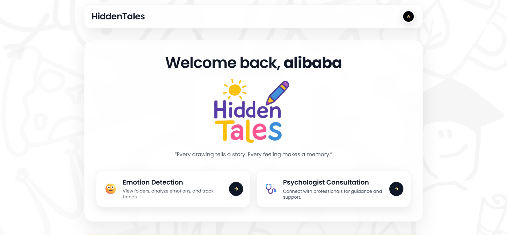
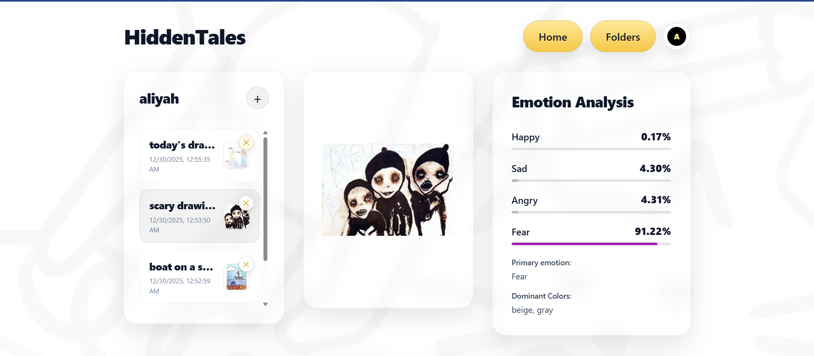
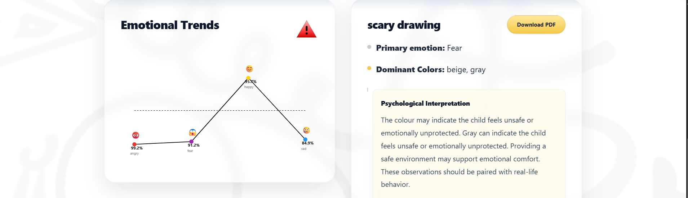
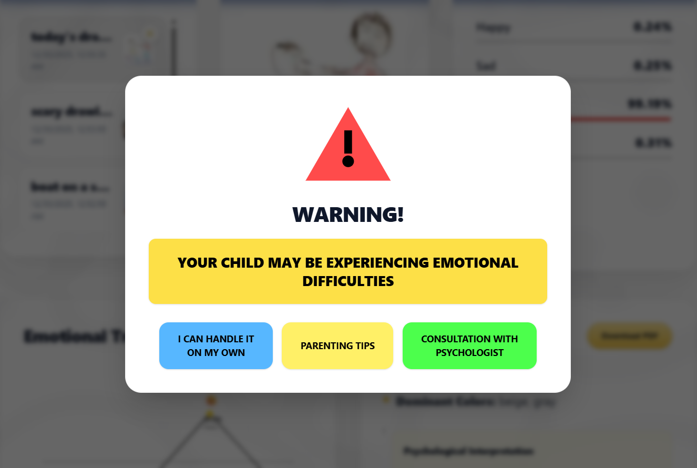
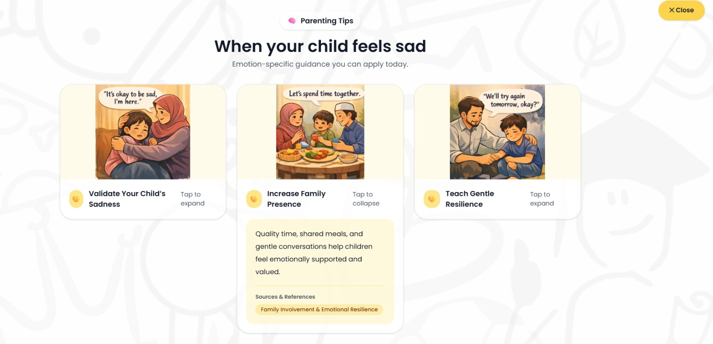
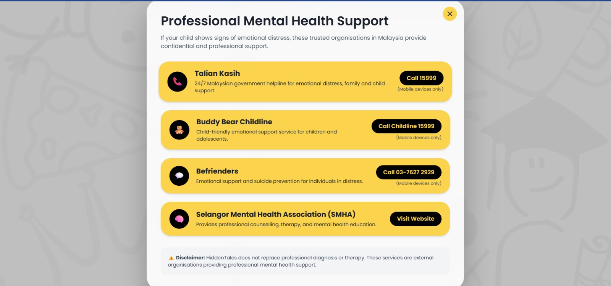
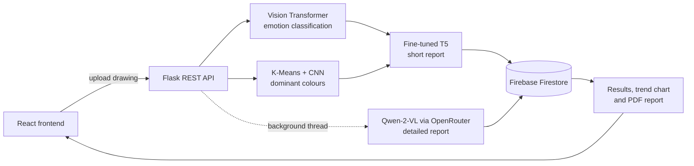

# HiddenTales

**AI-based emotion detection in children's drawings.** A parent uploads a drawing, and HiddenTales predicts the emotion behind it, identifies the dominant colours, and writes a short psychological interpretation.

🏆 **2nd Place, Ethics and Virtue Category — FYP2 INNOVATEX Showcase 2025**

Final Year Project, International Islamic University Malaysia (IIUM), Feb 2025 – Jan 2026.

> HiddenTales supports emotional awareness and early reflection. It is not a diagnostic tool and does not replace a professional psychological assessment.

## Demo

The app is not deployed live. The screenshots and video below show it running.

| Welcome page | Drawing analysis |
|---|---|
|  |  |

| Emotional trend and report | Alert for negative emotions |
|---|---|
|  |  |

| Parenting tips | Mental health support |
|---|---|
|  |  |

🎥 **Demo video:** [link to be added](#)

## How it works



1. **Emotion.** A Vision Transformer (`vit_base_patch16_224`) classifies the drawing as happy, sad, angry or fear.
2. **Colour.** K-Means extracts the three dominant colours, and a small CNN names each one from a palette of 27 colours.
3. **Short report.** A fine-tuned FLAN-T5 model turns the emotion and colours into a short interpretation.
4. **Detailed report.** The drawing is sent to Qwen-2-VL in the background. The frontend polls until this report is ready.
5. **Storage.** Results are saved to Firestore and shown with a trend chart and a downloadable PDF.

### Model results

| Model | Task | Result |
|---|---|---|
| Vision Transformer | 4-class emotion classification | about 82–84% test accuracy |
| CNN | Naming 27 colours | 98.5% test accuracy |
| FLAN-T5 | Report generation | ROUGE-1 0.51, ROUGE-L 0.43 |

## Key features

- Emotion prediction with a confidence score for each of the four emotions
- Dominant colour detection
- Two-part AI-generated psychological interpretation
- A folder per child, with an emotional trend chart across their drawings
- Downloadable PDF report
- An alert when a drawing suggests a negative emotion, linking to parenting tips and Malaysian support helplines
- Parent accounts with a reflection journal

## Tech stack

| Layer | Tools |
|---|---|
| Frontend | React 19, React Router, Tailwind CSS, Framer Motion |
| Backend | Python, Flask, ReportLab |
| AI / ML | PyTorch, timm, TensorFlow/Keras, Hugging Face Transformers, scikit-learn |
| External model | Qwen-2-VL through the OpenRouter API |
| Database | Firebase Firestore |
| Hosting and design | AWS S3 (frontend), ngrok (backend tunnel), Figma |

## Project structure

```
├── backend/
│   ├── app.py                  # Flask REST API and AI pipeline
│   ├── requirements.txt
│   ├── .env.example
│   └── TrainingModels/
│       ├── ViTModelFYP2.ipynb              # emotion model training and evaluation
│       ├── colorModel_t5Model.ipynb        # colour CNN and T5 report model
│       └── callingAPI_FinalTesting.ipynb   # end-to-end pipeline test
├── frontend/hiddentales/
│   ├── src/pages/              # home, welcome, folders, upload, parenting, psychologist, profile
│   ├── src/config/api.js       # API helper
│   └── .env.example
└── docs/screenshots/
```

## Run locally

You need Python 3.12, Node.js 18 or later, a Firebase project with Firestore enabled, and an OpenRouter API key.

### 1. Backend

```bash
cd backend
python -m venv venv
venv\Scripts\activate          # macOS/Linux: source venv/bin/activate
pip install -r requirements.txt
cp .env.example .env           # then fill in your values
```

Then:

- Download a service account key from your Firebase project, place it in `backend/`, and set `FIREBASE_KEY_PATH` in `.env` to its filename.
- Add the model weights (see below).
- Start the server with `python app.py`. It runs on `http://localhost:5000`.

### 2. Frontend

```bash
cd frontend/hiddentales
npm install
cp .env.example .env           # REACT_APP_API_BASE_URL=http://localhost:5000
npm start
```

The app opens on `http://localhost:3000`.

### Environment variables

| File | Variable | Purpose |
|---|---|---|
| `backend/.env` | `OPENROUTER_API_KEY` | Key for the Qwen-2-VL report |
| `backend/.env` | `PUBLIC_BACKEND_URL` | Base URL used to build image links |
| `backend/.env` | `FIREBASE_KEY_PATH` | Filename of the Firebase service account key |
| `frontend/hiddentales/.env` | `REACT_APP_API_BASE_URL` | URL of the Flask backend |

### Model weights

The weights are not in this repository because of their size. The backend expects them here:

```
backend/fypModels/fypModels/
├── HiddenTales_Model/           best.torchscript, classes.json
├── color_model_export/color_model_export/
│   ├── HiddenTales_ColorModel_Improved.keras
│   └── color_dataset/label_names.json
└── nlp_model_export/nlp_model_export/HiddenTales_T5_Final/
```

The colour and T5 models can be retrained from `colorModel_t5Model.ipynb`, which generates its own training data. The emotion model was trained on the private drawing dataset with `ViTModelFYP2.ipynb`. Contact us if you need the weights for evaluation.

## Dataset

**The dataset is not included, to protect children's privacy.** The emotion model was trained on labelled children's drawings in four classes (angry, fear, happy, sad).

## Authors

**Sheikh Aiman Hadi bin Shekh Faisal**

- LinkedIn: [linkedin.com/in/sheikh-aiman-hadi-shekh-faisal-a6b4532a1](https://www.linkedin.com/in/sheikh-aiman-hadi-shekh-faisal-a6b4532a1)
- Email: [aimanhadi100@gmail.com](mailto:aimanhadi100@gmail.com)

**Muhammad Nazrin bin Jamil**
